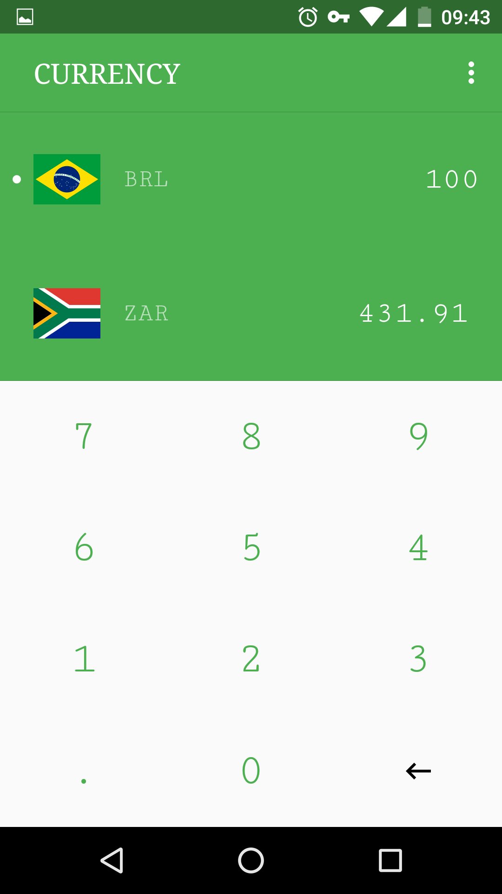
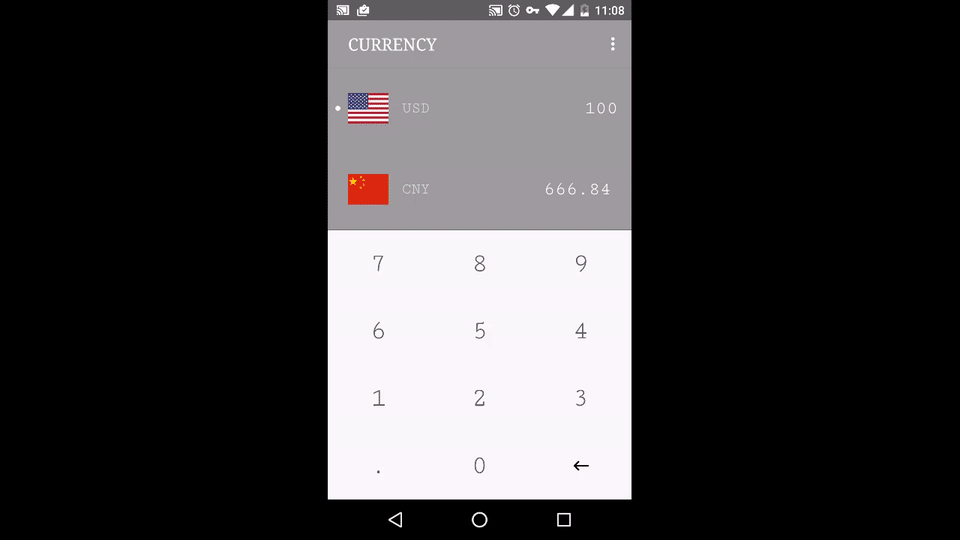

# Currency

[中文 README](# 中文)

:money_with_wings:A beautiful currency conversion app written in Kotlin and using Anko. Supports multi-theme with smooth animation.



### Kotlin

Kotlin is a statically typed language targeting the JVM. It's created by JetBrains. Kotlin is concise, safe, versatile and interoperable. Go to [kotlinlang.org](https://kotlinlang.org/) to learn more about Kotlin.

```
fun main(args: Array<String>) {
    println("hello world")
}
```

### Anko

By default, UI in Android is written using XML. But with Anko there is a new way. I used Anko to make a beautiful UI in this project.

```
override fun createView(ui: AnkoContext<MainActivity>): View = with(ui) {
    verticalLayout {
        val toolbar = toolBar {
            //init
        }.lparams {
            //init layout params
        }

        // other views...
    }
}
```


### About me

A student of UESTC.  
Email: yiyuanliu1997@gmail.com

--------------------------------------------------------------------------

## 中文

一个美观的汇率转换软件，使用 Kotlin 编写，通过 Anko 框架编写 UI 并实现漂亮的主题动态切换效果。


## Kotlin

JetBrains 维护的 JVM 语言。和 Java6 相比，kotlin 表达更为简洁，提供 Lambda 表达式、类型推断、null 安全等特性。

```
fun main(args: Array<String>) {
    println("hello world")
}
```

## Anko

Anko 是 Kotlin 提供的 ui 框架，通过 Anko 我们可以在代码中定义布局。Anko 比 xml 的使用更加强大，在 Anko 中可以方便的设置 listener ，也可以引用已有的 layout 文件。本项目中 ui 的主要部分使用 anko 框架编写，实现了很好的主题切换效果。

```
override fun createView(ui: AnkoContext<MainActivity>): View = with(ui) {
    verticalLayout {
        toolBar {
            //init
        }.lparams {
            //init layout params
        }

        // other views...
    }
}
```


## 汇率数据

汇率数据通过雅虎财经提供的 Api 获得，网络请求部分使用 retrofit 框架。

## About me
电子科技大学大三学生。  
email: yiyuanliu1997@gmail.com
